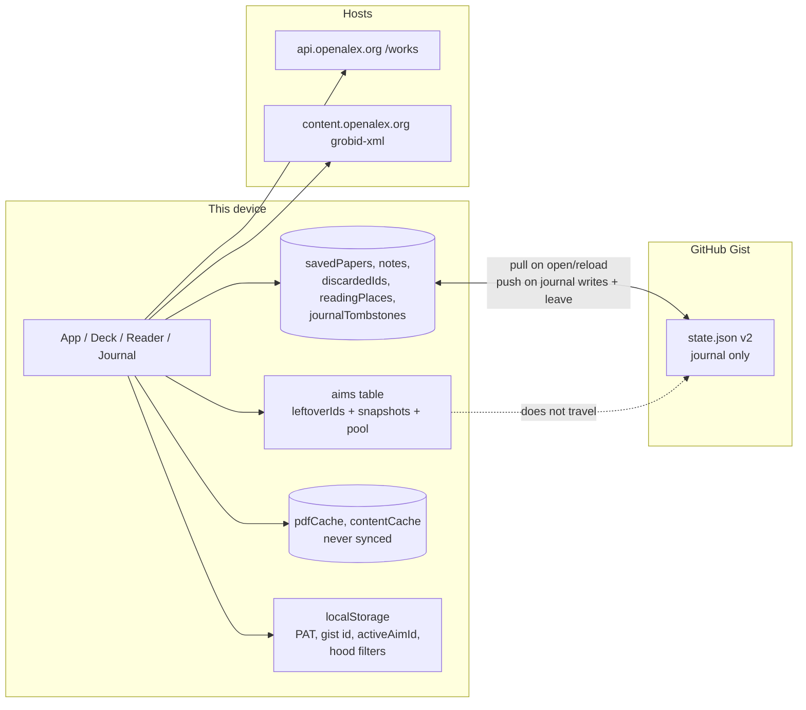
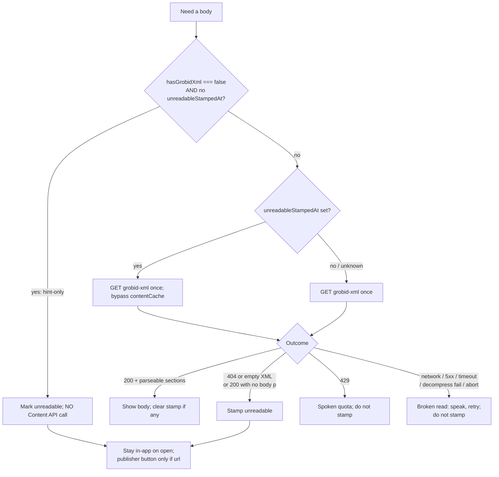

# Daily Ritual Spec — Academic Serendipity Reader

| Field | Value |
| --- | --- |
| **Title** | Daily ritual spec for the personal reader |
| **Author** | design-doc-writer (from Wayfinder map) |
| **Date** | 2026-08-17 |
| **Status** | Draft |
| **Audience** | Implementing engineer or agent working in this repo |
| **Source map** | [Daily ritual spec for the personal reader](https://github.com/nspage/acadPap-proj/issues/1) |

This document collapses the closed Wayfinder map into one buildable spec. The eleven ticket resolutions are law. Implementation choices below realize those resolutions; they do not reopen them.

`agy_spec.md` predates OpenAlex-only GROBID and the ritual decisions. Do not treat it as current law.

---

## Overview

Academic Serendipity Reader is a personal PWA for one user (Nico), used on a phone and a laptop the same day. The daily ritual is: open the leftover stream, swipe a few papers, tap one to read in-app, capture a note while the text is on screen, walk away. The other device must then open the same saved paper at the same body paragraph with the same note.

Today that ritual is broken in specific, named ways. The swipe deck is in-memory React state (`SwipeDeck` copies `papers` and `slice(1)`). Swipe-right is "Save & Read" and `handleSavePaper` either opens the reader or `window.open`s the publisher. Notes wait for a Save button. There is no reading-place field. Gist sync writes `savedPapers` / `notes` / `sources` / `discardedIds` as a boot-only upsert, does not push discards, does not propagate deletes, and fails with `console.error` only. About one in five feed cards have no GROBID XML; the reader opens and then fails.

This spec makes the sitting an open stream with a device-local leftover stack per aim; makes save and open different acts; stamps unreadables without navigating away; writes notes and place so the shared Gist journal actually matches; and speaks the failures the map named. Settings and keys stay in the hood. Silent failure may not.

---

## Background & Motivation

### Current architecture (HEAD, this clone)

Vite + React 18 PWA (`vite-plugin-pwa`, standalone). Dexie database `AcademicSerendipityDB` at schema version 5 (`src/lib/db.ts`). GitHub Gist is the only cloud pipe (`src/services/gist-sync.ts`). Discovery is OpenAlex Works (`src/services/adapters/openalex.ts`). The in-app body is OpenAlex Content API GROBID TEI only (`src/services/openalex-content.ts`). `/api/proxy`, `cachePaperPdf`, and `fetchWithCORSProxy` have no callers on the reader path. Unpaywall was added in `e8210c5` and deleted in `7eca805`.

Boot path in `App` (`src/App.tsx:62–79`): `initializeDatabase()` → if `localStorage.github_pat` and `gist_id` exist, `pullStateFromGist` → `loadFeed()`. `loadFeed` fetches page 1 of every **enabled** `sources` row, Fisher-Yates shuffles (`fetchAllEnabledPapers`), drops saved and discarded IDs, and replaces the in-memory `papers` array.

### Pain points the map already closed

| Pain | Where it lives today | Locked resolution |
| --- | --- | --- |
| Deck forgotten on close / device bounce | `SwipeDeck` `useState`; `App.papers` | Leftover stack is an ID list + order, device-local. Opening restores it. No fetch. |
| Swipe-right navigates | `handleSavePaper` opens reader or `window.open` | Swipe-right is save only. Stay on the stream. |
| Save-without-content leaves the app | `window.open(paper.url)` at `App.tsx:109` | Save never navigates. |
| ~20% of the `has_fulltext` feed has no GROBID XML | `hasContent = grobid_xml \|\| pdf`; reader fetches XML only | Unreadable stamp; stay in-app; no PDF/Unpaywall hunt. |
| Notes require a button and do not save the paper | `ReaderModal.handleSaveNote` | First real mark saves; every mark writes immediately. |
| No place | No Dexie column, no gist field | Paragraph-at-top, written on leave, gist-backed for saved papers. |
| Gist overwrites the other device's aim | `sources` in `SyncState`; pull `bulkPut`s them | Stream / `sources` stay off Gist. |
| Deletes and discards do not match | Pull is upsert; discard is not in the 3s debounce deps | Deletes and discards push. |
| Failures are silent | `console.error` only | Named failures speak. |

### Research facts this spec depends on (do not re-measure)

From [What does Gist sync actually carry today?](https://github.com/nspage/acadPap-proj/issues/6) and [What can we actually open in-app?](https://github.com/nspage/acadPap-proj/issues/7):

1. Gist carries metadata only. `pdfCache` and `contentCache` never leave the device.
2. No reading-position field exists. The deck is in-memory only.
3. Pull is boot-only upsert. Deletes / empty tables do not propagate. Discard-only edits do not debounce-push.
4. Failures are console-only. PAT + gist id are per-device `localStorage`.
5. Classic `gist` scope (or fine-grained **Gists: write**). Authenticated 5,000 req/h. GET `content` truncated at 1 MB. This client never checks `truncated`.
6. HEAD reader = Content API GROBID XML only. Unpaywall and `/api/proxy` unused on that path.
7. `is_oa` / `oa_url` / `pdf_url` are location hints; `has_content.*` is the archive.
8. 20.3% of the current `has_fulltext` feed has no GROBID XML (measured 2026-08-16).
9. Free key ≈ 100 XML/PDF downloads/day; key is hardcoded in client JS (`OPENALEX_API_KEY` in `openalex-content.ts` and `Authorization: Bearer …` in `openalex.ts`).
10. OpenAlex grants no extra copyright. This spec does not change the feed filter, the daily cap, or secrets hygiene.

---

## Goals & Non-Goals

### Goals

- Make the daily ritual work on one phone and one laptop the same day, as the eleven tickets specified.
- Persist the leftover stream per aim on the device. Park on aim switch. Refresh inserts newer cards on top. Pool flip replaces the leftover stack.
- Separate **save** from **open**. Unreadable papers stay in the product, visibly marked. Save never navigates. Open stays in-app.
- Capture notes in the reader. First real mark implies save. Write each mark immediately.
- Store place as the body paragraph at the top of the viewport. Write on leave. Ride in the gist for saved papers only.
- Keep GitHub Gist as the journal pipe. Pull on open/reload only. Close the write-gaps (notes, deletes, discards, place). Stop syncing `sources` / the stream.
- Speak the named unexpected failures. Do not stamp unreadable on a download blip. Speak quota. Leftover / Dexie persist failures (save, note, discard, leftover stack) speak **now**. Journal gist failures retry quietly during the sitting and speak on leave / next foreground. Leftover never travels; there is no leftover→gist path.

### Non-goals (do not design, do not implement under this spec)

**Map "Not yet specified" (in-scope fog, deferred):**

- Offline cache of the clean article view as a product. (`contentCache` may store XML only after `kind === 'ok'`; do not expand this into an offline strategy. Do not sync content.)
- Secrets hygiene (Gemini key in `localStorage`, OpenAlex token in source).

**Map "Out of scope":**

- Shipping this to other people: accounts, onboarding, multi-user.
- Redesigning in-app reading typography, font controls, or the AI explainer.
- Redesigning the journal as a product surface.
- Returning to multi-repo adapters (arXiv / OSF / Zenodo) as first-class sources.
- Native iOS / Android apps.
- Social features, public sharing, collaborative reading.

**Also out of this spec:**

- Banner copy beyond the spoken-state rules in [What must never fail silently?](https://github.com/nspage/acadPap-proj/issues/3).
- Changing the OpenAlex feed filter (`has_fulltext:true,is_oa:true,language:en`).
- Changing the daily download cap or moving the OpenAlex key.
- Multi-tenant observability, feature-flag services, or a test framework the repo does not have.

---

## Domain Vocabulary

Use these words in code comments, types, and tickets. Do not invent synonyms.

| Term | Meaning |
| --- | --- |
| **Sitting** | An open stream. No session-complete state. No product-imposed card count. You swipe until you leave. **Done for now** is closing the app, not a button. |
| **Stream** | This device's leftover pile for the current aim. Device-local. Not the journal. |
| **Aim** | One steer at a time: **Global Recent**, or **one rabbit-hole topic**. Each aim on this device keeps its own leftover stack. |
| **Leftover stack** | Ordered list of paper IDs for one aim, plus enough local card snapshots to render them without a fetch. Gist-shaped metadata, not paper bodies. Never travels. |
| **Pool** | A sitting-level flip on the **same** aim: **recent** ("whatever just dropped" — the full recent pool) vs **cited** ("the cited stuff" — only papers that already have some impact). Flip is a destructive re-aim. |
| **Journal** | The shared record: saved papers (including removals), discarded IDs, notes, place in a saved paper. |
| **Place** | The body paragraph at the top of the viewport. Not a pixel scroll, not a percent, not a sentence inside the paragraph. |
| **Unreadable** | The in-app reader cannot show a body. Expected ~1 in 5 cards in today's pile. |
| **Unreadable stamp** | A persisted mark (`unreadableStampedAt`) after a confirmed no-body Content fetch. Visible wherever the paper is shown. Can lift on a later open of a **stamped** row that now has the view. Hint-only (`hasGrobidXml === false`, no stamp) shows the same badge but never fetches Content and does not lift via GROBID. Not applied on a download blip. |
| **Real mark** | The first character in takeaways or synthesis, the first saved quote, or the first jargon term. Opening an empty notes surface is not a real mark. |
| **Implied save** | The first real mark puts the paper in the journal. One-way: clearing the note later does not remove it. |
| **Spoken failure** | An unexpected failure that must be visible in the UI with retry (or "come back later" for quota). Not `console.error` alone. Expected unreadable is not this — it is the stamp. |
| **Hood** | Settings, keys, quality filters. May stay. Not the sitting. |

---

## Proposed Design

### Daily ritual (end-to-end)

The sequence the other device must be able to continue.

```mermaid
sequenceDiagram
    actor Nico
    participant Phone
    participant Dexie as Dexie (phone)
    participant Gist as GitHub Gist
    participant OA as OpenAlex
    participant Laptop
    participant DexieL as Dexie (laptop)

    Nico->>Phone: Open PWA
    Phone->>Gist: GET state.json (pull on open)
    Gist-->>Phone: journal (saved, notes, discards, place, tombstones)
    Phone->>Dexie: merge journal
    Phone->>Dexie: evict leftover IDs now in saved/discarded; restore aim
    Note over Phone: No feed fetch. Leftovers as left, minus journaled IDs.

    Nico->>Phone: Swipe right (save only)
    Phone->>Dexie: savedPapers.put; drop from leftover
    Phone->>Gist: schedule PATCH (journal)
    Note over Phone: Stay on the stream.

    Nico->>Phone: Tap next card (open, not save)
    Phone->>OA: GET grobid-xml (once)
    OA-->>Phone: TEI body
    Nico->>Phone: Type first character
    Phone->>Dexie: notes.put + implied savedPapers.put
    Phone->>Gist: schedule PATCH (notes leave as you mark)

    Nico->>Phone: Close / lock / switch apps
    Note over Phone: One App-owned leave pipeline
    Phone->>Dexie: 1. persistPlaceNow if saved reader open
    Phone->>Gist: 2. flushJournalPush (journal only; leftover stays local)

    Nico->>Laptop: Open PWA
    Laptop->>Gist: GET state.json
    Gist-->>Laptop: journal including note + place
    Laptop->>DexieL: merge journal
    Note over Laptop: Laptop leftover is its own. Journal matches.
    Nico->>Laptop: Open that saved paper
    Laptop->>OA: GET grobid-xml (content is not synced)
    Laptop-->>Nico: Same paragraph at top, note as typed
```

Same-day bounce is a **shared journal**, not a shared sitting ([What must match on phone and laptop the same day?](https://github.com/nspage/acadPap-proj/issues/4)). Each device keeps its own stream.

Must already match when the other device opens:

1. Saved papers, including removals
2. Discarded IDs
3. Notes
4. Place in a saved paper

Stays on the device:

5. Leftover deck
6. Topic mix (aims, chips, which aim is active, which pool)
7. Unsaved mid-reads (tap-to-read without a real mark; place does not travel)

### Architecture after this spec



---

### 1. Deck, aim, leftover persistence

Locked by [What is a daily session?](https://github.com/nspage/acadPap-proj/issues/8) and [How do you steer the deck?](https://github.com/nspage/acadPap-proj/issues/2).

#### One aim at a time

An aim is either Global Recent or one topic from the existing four-step drill (`RabbitHoleExplorer`: Domain → Field → Subfield → Topic). The sitting shows that aim's leftover stack.

Replace today's multi-enabled `sources` merge (`fetchAllEnabledPapers` + Fisher-Yates) as the sitting control. The pile is **one aim, one pool**. Settings quality filters (`filter_geo`, `filter_impact` in `localStorage`) remain hood and still AND into the OpenAlex filter. They are not the pool flip.

**Retire the sitting "Feed Ordering" / Top Impact toggle** (`App.tsx:249–265`, `toggleSortImpact`, `localStorage.sort_impact`). [How do you steer the deck?](https://github.com/nspage/acadPap-proj/issues/2) replaced sitting-level recency-vs-impact with the recent/cited **pool flip**. That toggle is not in Settings today; it is a deck control. Do not leave it next to the new pool flip. Do not move it into Settings as part of this spec. Stop reading `sort_impact` in `fetchOpenAlexPapers`. Default sort is the current non-impact path: `publication_year:desc`. The unread `localStorage.sort_impact` key may stay; do not write it.

#### Leftover stack

For each aim this device has used, persist:

- `leftoverIds: string[]` — order is the stack order; index 0 is the top card
- `leftoverCards: PaperCard[]` — local snapshots so a restore needs **no fetch**. **Invariant:** `leftoverCards[i].id === leftoverIds[i]` and both arrays have the same length. Every leftover mutation rewrites both in the same Dexie write.
- `pool: 'recent' | 'cited'`
- `lastFetchAt: number | null` and `lastFetchOk: boolean`

The map's product object is the ID list + order. Snapshots are an implementation necessity so "opening the app shows the leftover stack as you left it, no fetch" is possible. Snapshots never go to Gist.

#### Park / restore / refresh / flip

```mermaid
stateDiagram-v2
    [*] --> Restore: open app or tap aim chip
    Restore --> ShowingLeftover: evict saved/discarded IDs; no fetch
    ShowingLeftover --> ShowingLeftover: swipe save/discard<br/>(persist leftover)
    ShowingLeftover --> ShowingLeftover: tap card to read<br/>(stack unchanged)
    ShowingLeftover --> Parked: tap a different aim chip
    Parked --> Restore: write this leftover, load the other
    ShowingLeftover --> Refreshing: header refresh
    Refreshing --> ShowingLeftover: newer IDs prepended,<br/>old leftovers kept under them
    ShowingLeftover --> Flipping: tap recent/cited
    Flipping --> ShowingLeftover: leftover replaced by a new fetch
    ShowingLeftover --> EmptyOk: leftover empty after a successful fetch
    EmptyOk --> Refreshing: user taps refresh
    Restore --> FirstFetch: leftover empty AND lastFetchAt is null
    FirstFetch --> ShowingLeftover
    FirstFetch --> SpokenFail: pile failed
```



Rules:

1. **Open app or tap the current/another existing aim** — show that aim's leftover stack as left. **No fetch.** Newer papers wait.
2. **Evict journaled IDs (implementation of [What must match on phone and laptop the same day?](https://github.com/nspage/acadPap-proj/issues/4), not a re-decision of leftover-as-left).** After every journal pull, and again on every aim restore, drop leftover IDs that are now in `discardedIds` or `savedPapers`. Keep leftover order for the rest. Both devices on Global Recent will often share the same page-1 IDs; without this filter, a same-day discard on the laptop still sits on the phone leftover. Refresh already applies the same filter; restore and pull must too. This does not fetch and does not reshuffle.
3. **Switch aim** — persist (park) the current leftover + pool, then restore the target's leftover + pool (after the eviction in rule 2). Leftovers gone when you come back is the failure this forbids.
4. **Refresh** (header `RefreshCw`, or the empty-state refresh button) — fetch newer papers of the **current aim** under the **current pool**. Filter out saved IDs, discarded IDs, and IDs already in this leftover. **Prepend** the remainder. Leftovers keep their order underneath. Do not shuffle leftovers. Do not shuffle the new batch (API sort is already recency; refresh means newer on top).
5. **Pool flip** — destructive re-aim. Replace the leftover stack with a new fetch of the same aim under the other pool. Flipping back does **not** restore the old leftovers. Persist the new pool on the aim row.
6. **New hole** — `RabbitHoleExplorer.handleTopicClick` already returns `(shortId, display_name)`. Birth a chip `topic:${shortId}` with `openAlexFilter: topics.id:${shortId}`, park the current aim, switch, first-fetch **only if** `lastFetchAt === null`.
7. **One tap on the deck** — chips for Global Recent and every hole already dived; a recent/cited pool flip next to them. Extract the chip row currently inlined in `App.tsx:220–247` so it reads from `aims` + `activeAimId`, not from `sources.enabled`. **Delete** the "Feed Ordering" block at `App.tsx:249–265`. Do not put a recency/impact sort next to the pool flip.

#### First launch / empty leftover

The map says opening does not fetch. A genuine empty pile after a **successful** fetch may still say you are caught up (`SwipeDeck.tsx:72–89`, keep that empty state; do not redesign copy).

First-fetch is a one-shot for a never-fetched aim, not "every empty leftover":

| Predicate | What happens |
| --- | --- |
| `lastFetchAt === null` (leftover will be empty) | **One** initial fetch. This is first launch or a newly born hole. |
| leftover empty AND `lastFetchOk === true` | Caught-up. No fetch. User must refresh. |
| leftover empty AND `lastFetchOk === false` | Spoken pile failure + Retry. **Never** the caught-up card. |
| leftover non-empty | Restore (after journaled-ID eviction). **No fetch.** |

`aim-store` and every open/restore path must use `lastFetchAt === null` as the **only** automatic-fetch predicate. Do not first-fetch a successfully drained aim.

#### Fetch size

Keep `per_page=15` (`openalex.ts:41`). No product-imposed sitting length.

#### Swipe-right is save only

Today:

- Overlay copy is `SAVE & READ` (`SwipeDeck.tsx:139`).
- Footer button is `Save & Deep Read` / `Save & Read on Publisher ↗` (`PaperCardItem.tsx:132`).
- `handleSavePaper` opens the reader or a new tab (`App.tsx:101–110`).

Required:

- Swipe-right, `L` / ArrowRight, and the heart button **only** persist the paper in `savedPapers` and drop it from the leftover. Stay on the stream. Do not open the reader. Do not `window.open`.
- Overlay copy becomes `SAVE` (minimal label change so the gesture matches the rule; not a banner redesign).
- Reading is a **separate tap** on the card body (not on the abstract expand, not on the landing-page link, not on the heart/discard controls). Tap does **not** save and does **not** remove the card from the leftover.
- Unreadable cards still only save on swipe-right.

`SwipeDeck` today slices immediately and then calls `onSave`. Change the contract: App owns the leftover array. `SwipeDeck` reports the gesture; App persists; on persist failure App does not drop the card (or rolls it back) and speaks.

#### Landing-page link on the card

`PaperCardItem`'s existing `Landing Page` `<a target="_blank">` is an explicit user gesture, not a save side-effect. It may stay. It is not the open path and not the save path.

---

### 2. Unreadable path

Locked by [When a paper cannot be read in-app?](https://github.com/nspage/acadPap-proj/issues/5) and [What sources do we try before declaring a paper unreadable?](https://github.com/nspage/acadPap-proj/issues/9).

#### What we try

The in-app body is the **clean article view** only: `GET https://content.openalex.org/works/{W…}.grobid-xml` as `fetchStructuredContent` does today. **No PDF fallback. No Unpaywall. No publisher PDF. No landing-page HTML. No `/api/proxy`.**

Do not change the feed filter. About one in five cards will be unreadable. That is accepted.

#### When a paper is unreadable vs. when a read is broken



`hasContent` today is `Boolean(work.has_content?.grobid_xml || work.has_content?.pdf)` (`openalex.ts:95`). The reader never uses PDF. Change the **hint** used for the visible mark to `has_content.grobid_xml` only. Do not treat `has_content.pdf` as readable.

Fetch GROBID **only when the reader opens**. Do not prefetch on swipe. The free key is ≈100 content downloads/day.

#### Stamp rules

1. **Try once, then stamp.** A missing or empty article view is unreadable.
2. **A download blip is still retry, not a stamp.** Network, 5xx, timeout, `DecompressionStream` throw, aborted fetch, or "fetch helper down" → same spoken message as any failed download. Do not set `unreadable`.
3. **Hint-only vs stamped.** `hasGrobidXml === false` with **no** `unreadableStampedAt` is a hint from the Works row, not a failed Content fetch. On open: **do not** call the Content API. Show the unreadable mark and stay in-app. Do not re-fetch Works just to refresh the hint. Those leftover snapshots stay hint-only; they do not lift via a later GROBID probe.
4. **The stamp can lift — stamped rows only.** Lift applies only to rows with `unreadableStampedAt` (a prior `not_found` Content fetch). Open that paper again later. Bypass `contentCache`. If the view is there now, clear the stamp and read. Do not scan old saves in the background. Do not fetch Content for hint-only cards in the hope the archive grew.
5. Persist the stamp on the matching leftover snapshot **and** on `savedPapers` if the paper is saved, in the same Dexie transaction, so the journal list stays marked and `leftoverCards[i]` stays in sync.

#### UI rules

1. **Unreadables stay in the product.** They may appear as swipe cards. You may save them for later perusal.
2. **Spoken state (expected unreadable).** Wherever that paper is shown — deck card, saved/journal list, reader — the UI visibly marks it unreadable so the gesture is *save-for-later*, not *read-now*. A small badge is enough. Do not invent marketing copy. Suggested label: `No in-app text`.
3. **Save never navigates.** Delete the `window.open` branch in `handleSavePaper`. Saving only `put`s the row.
4. **Open stays in-app.** `JournalView` today branches on `paper.hasContent` and renders an `<a>Read on Publisher</a>` (`JournalView.tsx:146–164`). Change: **always** call `onOpenReader`. The reader explains there is no in-app text and — only if `paper.url` is a non-empty landing/publisher URL — offers a button. A new page opens only if that button is pressed. No URL means no button: stay and say so.

`ReaderModeView` today lumps every miss into "Structured content unavailable" plus an auto-rendered publisher `<a>` (`ReaderModeView.tsx:204–221`). Split that into (a) unreadable explanation + optional button, vs (b) broken-read explanation + Retry.

#### `fetchStructuredContent` must return a typed outcome

Today it returns `null` for HTTP not-OK, short XML, empty parse, and thrown errors (`openalex-content.ts:31–57`). That is why a 429, a 404, and a dropped Wi-Fi look the same.

See [API / Interface Changes](#api--interface-changes) for the new result type. Distinguish at the HTTP boundary:

| HTTP / parse | `kind` | UI |
| --- | --- | --- |
| 200, `sections.length > 0` | `ok` | Read |
| 404 | `not_found` | Stamp unreadable |
| 200, XML missing / `length < 100` / no body `<p>` | `not_found` | Stamp unreadable |
| 429 | `quota` | Spoken quota; no stamp |
| 0 / network / TypeError | `transient` | Retry; no stamp |
| 5xx, 408, 401, 403, other | `transient` | Retry; no stamp |
| Abort / timeout (20s) | `transient` | Retry; no stamp |
| `DecompressionStream` throw | `transient` | Retry; no stamp |

**Cache only after `kind === 'ok'`.** HEAD writes `contentCache` at `openalex-content.ts:45–51` **before** `parseGrobidXml`. A 200 with `length >= 100` and no body `<p>` is `not_found` **and** is already cached. That order is not correct. Put the cache write after a successful parse (`sections.length > 0`). Do not cache `not_found`, `quota`, or `transient`. If a parse is empty, delete any in-flight cache put for that `paperId`. Do not describe the current cache-before-parse order as already safe.

---

### 3. Notes

Locked by [When do you capture a note in the sitting?](https://github.com/nspage/acadPap-proj/issues/10).

1. **In the reader.** Typing happens while the paper is still on screen. Keep today's Reader / Notes tabs in `ReaderModal`. Tab-versus-pane is appearance; do not redesign it. Do not add a journal compose surface.
2. **First real mark saves.** A real mark is:
   - first non-whitespace character in `takeaways` or `synthesis`, or
   - first quote added (`handleAddQuote`), or
   - first jargon term added (`handleAddJargonTerm`).
   Opening the empty Notes tab is not a save. Swipe-right remains save-without-reading. This mark is a second path into the journal.
3. **Implied save is one-way.** `db.savedPapers.put(paper)` on the first real mark. Clearing takeaways/synthesis, deleting quotes, or emptying jargon later does **not** delete the paper. Drop the paper from the current leftover so it does not reappear in the stream.
4. **Written as you make it.** Each character, quote, or jargon term is written to Dexie immediately (`db.notes.put`). Remove the requirement to press `Save Notes` for durability. The button may remain as a no-op visual "saved" affordance or be dropped; either is fine so long as walking away mid-sentence leaves Dexie (and then Gist, after the journal push) holding what was typed.

`ReaderModal` today only writes on `handleSaveNote` (`ReaderModal.tsx:89–100`) and `console.error`s failures. Quotes and jargon update React state only until that click.

Implementation: a `persistNoteNow(note)` that `put`s the note and, if `isRealMark(note)` and the paper is not yet saved, `put`s the paper. On Dexie failure, speak and offer retry; do not pretend it worked.

Gist: notes leave as you mark — schedule a journal push after each successful Dexie write (short debounce; flush on leave). See §5.

---

### 4. Place

Locked by [How is place in a saved paper stored, and when is it written?](https://github.com/nspage/acadPap-proj/issues/12).

#### What is stored

The **body paragraph at the top of the viewport**. The other device opens that saved paper with that paragraph at the top of the screen.

Identity (implementation; see Key Decisions):

```ts
interface ParagraphPlace {
  sectionIndex: number;     // index into ContentResult.sections
  paragraphIndex: number;   // index into that section's paragraphs
  textPrefix: string;       // first 80 code points, whitespace-collapsed
}
```

Render every body `<p>` with `data-reading-place="${sectionIndex}:${paragraphIndex}"`. Do not attach place ids to the title or the abstract block.

#### Capture algorithm

The scroll container is the `overflow-y-auto` wrapper around `ReaderModeView` in `ReaderModal` (`ReaderModal.tsx:158`), not `window`.

On leave:

1. Query `p[data-reading-place]` in document order.
2. If there are none (unreadable, still loading, broken read), write nothing new (keep prior place).
3. Let `top = container.getBoundingClientRect().top`.
4. Let `firstVisible` be the first paragraph whose `bottom > top + 8`.
5. If none, the user has scrolled past the last paragraph → store the last paragraph.
6. If `firstVisible` is the first body paragraph **and** its `top > top + 48`, the title and abstract still occupy the top → **clear** place (`place: null`). That is also how you start over after you had gone further.
7. Otherwise store `{ sectionIndex, paragraphIndex, textPrefix }` from `firstVisible`.

Do **not** write as the user scrolls.

#### When to write

Only if the paper is in `savedPapers` at leave time. Unsaved mid-reads do not persist place and do not sync it.

Leave events (all of them):

| Event | Hook |
| --- | --- |
| Back to the deck or the journal | `ReaderModal` `onClose` (the X, and any parent `setSelectedReaderPaper(null)`) |
| Lock, switch apps, or close the tab with the paper still open | `document.visibilitychange` → `hidden`, and `window.pagehide` |
| Force-quit with no leave event | Keep the old place (accepted) |

`beforeunload` is unreliable in a standalone PWA, especially iOS. Do not depend on it.

#### One App-owned leave pipeline

Place write and gist flush must not be two independent `visibilitychange` / `pagehide` listeners. If `flushJournalPush` runs first, the PATCH omits the place just captured and the other device opens at the top.

**`App` owns hide / pagehide / explicit close.** Order is mandatory:

1. If a saved reader is open, `await readerRef.persistPlaceNow()` — capture the paragraph, `readingPlaces.put`. `ReaderModal` implements `persistPlaceNow()` (or an equivalent imperative handle). It does **not** register its own gist flush and does **not** call `flushJournalPush`.
2. Then `await flushJournalPush()`. The PATCH is journal only (`savedPapers`, `notes`, `discardedIds`, `readingPlaces`, `tombstones`). Leftover / aims never ride this flush.

The X / `onClose` path uses the same two steps (persist place, then the parent may schedule or flush depending on whether the sitting continues). Lock / switch apps / tab close always runs the full pipeline.

If step 1's Dexie write fails, treat it like journal sync (see failure taxonomy): set `localStorage.sync_failed_on_leave`, do not paint a hide-time toast, speak on next foreground. Retry re-runs capture if the reader is still mounted; otherwise keep the old place. Still attempt step 2 so notes/discards already in Dexie can leave.

#### Restore

After GROBID has rendered:

1. If no row, or `place === null`, stay at the top.
2. Look up `sections[sectionIndex].paragraphs[paragraphIndex]`. If `normalizePrefix(text) === textPrefix`, `scrollIntoView({ block: 'start' })`.
3. Else linear-search all paragraphs for that prefix.
4. If still not found, treat as no place — open at the top. Do not speak. Do not stamp.

---

### 5. Gist journal

Locked by [Does GitHub Gist stay the sync mechanism?](https://github.com/nspage/acadPap-proj/issues/11), against the facts in [What does Gist sync actually carry today?](https://github.com/nspage/acadPap-proj/issues/6).

Gist **stays**. No new sync service. One user, two devices, same day. PAT and gist id stay in per-device settings (`SettingsModal` `github_pat` / `gist_id`). The hood can stay.

#### Read

Pull when you **open or reload** that device (`App` boot `useEffect`, already). Also pull once when Settings saves a newly non-empty PAT+gist pair (otherwise first configure would require a reload). An app left sitting does **not** poll. No live two-screen sync.

#### Write — close today's gaps

| Gap today | Required |
| --- | --- |
| Notes wait for Save + 3s debounce | Dexie on every mark; gist scheduled immediately after (750ms debounce) and flushed on leave |
| `discardedIds` not in debounce deps (`App.tsx:99`) | Discards schedule a push |
| `handleRemoveSavedPaper` does not propagate (pull never deletes) | Tombstones travel; pull applies them |
| No place field | `readingPlaces` travels |
| Failures are `console.error`; push boolean ignored | Quiet retry during the sitting; speak if still failing on background/close |
| `sources` overwrite the other device's aim | **Stop reading and writing `sources`** |

Stream stays off Gist: leftover stacks, active aim, pool, topic mix, `sort_impact`, `filter_geo`, `filter_impact` do not travel.

#### Payload

Today (`gist-sync.ts:3–8`):

```ts
export interface SyncState {
  savedPapers: any[];
  notes: any[];
  sources: any[];
  discardedIds: any[];
  lastSyncedAt: number;
}
```

Push is pretty-printed `JSON.stringify(state, null, 2)` as gist file `state.json`. Pull `bulkPut`s each array if `.length` is truthy — empty arrays and local-only rows are left alone.

After:

```ts
export const JOURNAL_SCHEMA_VERSION = 2 as const;

export interface JournalSyncState {
  schemaVersion: typeof JOURNAL_SCHEMA_VERSION;
  savedPapers: PaperCard[];
  notes: PaperNote[];
  discardedIds: Array<{ id: string; discardedAt: number }>;
  readingPlaces: ReadingPlaceRow[];
  tombstones: JournalTombstone[];
  lastSyncedAt: number;
}
```

`sources` is absent. `lastSyncedAt` remains a write-only clock (do not use it as a merge key). Stop pretty-printing (`JSON.stringify(state)`) — 1 MB is the first GET limit.

#### Merge on pull (last write wins)

One person bouncing devices, not two editors. Conflicts are silent.

Per-row LWW so a failed last push does not get clobbered by an older gist on the next boot:

1. Ensure every `savedPapers` / `notes` / `readingPlaces` row has `updatedAt` (migrate existing saved papers to `updatedAt: Date.now()` once).
2. For each remote `savedPapers` / `notes` / `readingPlaces` row: `put` if no local row or `remote.updatedAt >= local.updatedAt`.
3. For each remote tombstone: if no local saved row or `tombstone.deletedAt >= local.updatedAt`, delete local `savedPapers`, `notes` (by `paperId`), `readingPlaces`, and `contentCache` / `pdfCache` for that id; upsert the tombstone locally.
4. `discardedIds`: union `bulkPut`. Discard is one-way.
5. **Ignore `state.sources` if present** (old gists). Never `bulkPut` them.
6. Do this in one Dexie `rw` transaction on the journal tables.
7. **After the journal transaction commits**, call `evictJournaledFromLeftovers()` on **every** aim row: drop leftover IDs that are now in `savedPapers` or `discardedIds`, preserving order. Same helper as aim restore. Leftover still does not travel; this only subtracts IDs the shared journal now owns.

Push writes the **current local journal snapshot** (including tombstones). Whole-file last PATCH wins if both devices are left sitting; that is accepted.

#### Truncation

On GET, inspect `gist.files['state.json'].truncated`. If `true`, do **not** `JSON.parse` the prefix. `GET` `raw_url` (full file up to 10 MB). If that fails or the file is unusable, treat as a failed pull (local DB unchanged, spoken on the next opportunity — pull failure at boot is a broken sitting for the **journal**, but the leftover stream must still restore; see failures).

On push, if `payload` UTF-8 size `> 1_000_000`, still attempt the PATCH (write cap is undocumented) but record that the next GET may truncate; speak if the subsequent pull would be unsafe. Do not invent compression.

#### Push scheduling

Replace the `useEffect` on `[savedPapers, notes, dbSources]` (`App.tsx:81–99`).

```ts
// src/services/gist-sync.ts
scheduleJournalPush(): void   // debounce 750ms after a journal write
flushJournalPush(): Promise<boolean>  // cancel debounce, PATCH now
```

Call `scheduleJournalPush` after successful Dexie writes to saved / notes / discards / tombstones / places. Do **not** register a second hide/pagehide listener here. Hide / pagehide / close run the [one App-owned leave pipeline](#one-app-owned-leave-pipeline) (persist place, then `flushJournalPush`).

Quiet retry during the sitting: if a PATCH fails, retry with backoff (e.g. 5s, 15s, 45s) while `document.visibilityState === 'visible'`. Do not toast those retries.

Speak on leave: see §6. You cannot reliably paint a modal as iOS backgrounds a PWA. Persist `localStorage.sync_failed_on_leave = 'true'` if the flush fails or never got to run while dirty, and speak immediately on the next `visible` / next boot.

Phone/laptop both writing: last write wins, silent.

#### Auth / rate limits (do not change)

- Header stays `Authorization: token ${pat}` (what the client already sends).
- Settings copy stays classic `gist` scope; fine-grained **Gists: write** also covers PATCH.
- 5,000 req/h is not the constraint for a human sitting. Debounced PATCH keeps secondary limits (PATCH ≈ 5 points) out of reach.
- A gist with the URL is not private. Already true; hood can stay.

---

### 6. Failure taxonomy

Locked by [What must never fail silently?](https://github.com/nspage/acadPap-proj/issues/3). Expected unreadable is issue 5, not this table.

Do not design banner copy beyond these rules. Required: a visible message, the named moment, and Retry where the table says retry. A single `SpokenNotice` component (inline in the deck, inline in the reader, and a boot/foreground notice for **journal** sync) is enough. No toast library.

| Case | How to detect | When to speak | UI behavior | Must not do |
| --- | --- | --- | --- | --- |
| **Broken sitting — pile failed** | `fetchOpenAlexPapers` throws / non-OK / network. `fetchPapersFromSource` today swallows and returns `[]` (`adapters/index.ts:14–16`) — **stop swallowing**. | Now | Message + Retry. Keep any leftover already on screen. | Never show "You're All Caught Up!" for a failed fetch. |
| **Broken sitting — save / note / discard / leftover persist did not stick** | Dexie `put`/`delete` throws on those tables (including `aims` leftover writes) | Now | Speak. Put the card back on the leftover (save/discard) or keep the note dirty and offer retry. | Do not slice the card away. Do not clear the textarea. Do not pretend it worked. Do not PATCH leftover to gist. |
| **Broken read** | Content fetch `kind: 'transient'` after we had reason to expect a body (`hasGrobidXml === true`, or unknown — **not** hint-only `hasGrobidXml === false`) | Now | "Couldn't get the text" + Retry. Stay in-app. | Do not stamp unreadable. Do not fetch Content for hint-only cards. |
| **No body → unreadable** | `kind: 'not_found'`, or hint-only (`hasGrobidXml === false`, no stamp) | As the expected unreadable mark | Stay in-app. Explain. Publisher button only if `paper.url`. | Do not hunt. Do not `window.open` unless the button is pressed. Hint-only: no Content fetch. |
| **Spoken quota** | Works or Content API HTTP 429 | Now | Cap is used, come back later. Journal tab still works. Same message whether it hits the pile or one body. | Do not stamp the paper. Do not empty the leftover. |
| **Cloud journal sync** | PATCH/GET not-OK, network, truncated-unusable, parse fail | Quiet retry during the sitting. Speak if still failing when the app backgrounds or closes (and on next foreground if the leave paint was impossible). | Leave notice / next-open notice + Retry. | Do not block swiping on a transient PATCH fail. Leftover is not in this payload. |
| **Place Dexie write failed** | `readingPlaces.put` throws inside `persistPlaceNow` | Same as journal sync: set `sync_failed_on_leave`; speak on next foreground. Do not paint a hide-time toast. | Retry re-runs capture if the reader is still mounted; else keep the old place. Then still attempt `flushJournalPush` for other journal rows. | Do not invent banner copy. Do not treat this as a leftover/gist leftover. |
| **Gist conflict** | Two devices wrote | Never | Last write wins. | No merge UI. |
| **Genuine empty pile** | `lastFetchOk === true` and leftover empty (after journaled-ID eviction) | — | Existing "You're All Caught Up!" + refresh button | Do not use this state for errors or for `lastFetchAt === null`. |
| **Missing stored paragraph** | Prefix / indices not found | Never | Open at top | Do not speak. |
| **Unsaved mid-read lost on the other device** | By design | Never | — | — |

Pull failure at boot: leftover still restores (device-local). Journal may be stale. Speak that the journal did not load, with Retry (retry is `pullStateFromGist` only, not a feed fetch).

`loadFeed` today `console.error`s and then renders `SwipeDeck` with whatever `papers` last was — on first load that is `[]`, which is "You're All Caught Up!" (`App.tsx:54–59` + `SwipeDeck.tsx:72`). That path is forbidden.

---

### 7. Implementation notes against existing modules

| Module | What changes |
| --- | --- |
| `src/types/index.ts` | Add the interfaces in [API / Interface Changes](#api--interface-changes). Extend `PaperCard` with `hasGrobidXml`, `unreadable`, `unreadableStampedAt`, `updatedAt`. |
| `src/lib/db.ts` | Dexie v6: add `aims`, `readingPlaces`, `journalTombstones`; index `savedPapers.updatedAt`. Upgrade migrates `sources` → `aims`. Keep `sources` / `pdfCache` / `contentCache` in the store list so old data is not deleted. `initializeDatabase` must seed Global Recent into `aims` if empty. |
| `src/services/aim-store.ts` **(new)** | `getAim`, `listAims`, `parkAim`, `restoreAim`, `prependRefresh`, `replaceStackForPoolFlip`, `dropFromLeftover`, `evictJournaledFromLeftovers`, `setActiveAimId`. Every leftover mutation keeps `leftoverCards[i].id === leftoverIds[i]`. App must not keep a second leftover source of truth. First-fetch only if `lastFetchAt === null`. |
| `src/services/gist-sync.ts` | `JournalSyncState` v2. Ignore `sources` on pull. Include discards, places, tombstones. `truncated` check. `scheduleJournalPush` / `flushJournalPush`. Typed errors, not `console.error` only. After pull, caller runs `evictJournaledFromLeftovers`. |
| `src/services/openalex-content.ts` | Return `ContentFetchResult`. 20s `AbortController`. Cache **only** after `kind === 'ok'`. Optional `bypassCache` for stamped re-open. No fetch when hint-only. |
| `src/services/adapters/openalex.ts` | Set `hasGrobidXml` from `has_content.grobid_xml`. When `aim.pool === 'cited'`, AND `cited_by_count:>5` (`CITED_POOL_MIN_CITATIONS = 5`). Surface 429 as quota. Keep hood `filter_geo` / `filter_impact`. **Stop reading `sort_impact`.** Default `publication_year:desc`. |
| `src/services/adapters/index.ts` | Stop returning `[]` on catch (PR 2, with the empty-state guard). Throw or return a `Result`. Sitting is one aim: add `fetchPapersForAim(aim)` and stop using multi-source shuffle as the sitting fetch. |
| `src/App.tsx` | Boot: pull journal → `evictJournaledFromLeftovers` → restore active aim leftover (fetch **only if** `lastFetchAt === null`). Own leftover. Save ≠ open. Discard schedules push. Refresh prepends. Aim chips park/restore. Pool flip replaces. **Single leave pipeline:** `persistPlaceNow` then `flushJournalPush`. Delete `toggleSortImpact` and the Feed Ordering UI. Spoken notices. Stop depending on `dbSources` for the pile. All pile mutations go through `aim-store`. |
| `src/components/deck/SwipeDeck.tsx` | Controlled leftover. Save-only overlay. Empty state only if `lastFetchOk && leftover empty`. Wire Retry for pile failure from parent, not the caught-up card. PR 2 ships this guard with the fetch-path change. |
| `src/components/deck/PaperCardItem.tsx` | Unreadable badge. Card-body tap → `onOpen`. Heart/footer save no longer means read. Drop "Save & Read on Publisher ↗". |
| `src/components/deck/RabbitHoleExplorer.tsx` | Keep the four-step drill. `onSelectTopic` creates/switches an aim; do not `loadFeed()` as a full replace. |
| `src/components/reader/ReaderModal.tsx` | Immediate note persist; implied save; expose `persistPlaceNow()`; do **not** register hide/pagehide gist flush. Place only if saved. Hint-only open does not fetch Content. |
| `src/components/reader/ReaderModeView.tsx` | `data-reading-place` on body paragraphs; restore scroll; split unreadable vs broken-read vs quota; no auto navigation; no Content fetch for hint-only. |
| `src/components/journal/JournalView.tsx` | Always `onOpenReader`. Unreadable badge. Do not redesign the journal. |
| `src/components/settings/SettingsModal.tsx` | Keep PAT/gist/Gemini/geo/impact. Saving new gist credentials triggers one pull. **Disconnect** source Enable/Disable: stop passing a live `onToggleSource` (render the buttons disabled, or drop the handler). Do not write `sources.enabled` as if it still built the pile. Do not redesign the hood. |
| `src/components/common/Header.tsx` | Refresh calls `refreshAim`, not `loadFeed`. |
| `src/components/common/SpokenNotice.tsx` **(new)** | Visible message + optional Retry. Used by deck, reader, and boot/foreground sync. |
| `src/lib/reading-place.ts` **(new)** | `normalizePrefix`, `capturePlace`, `restorePlace`. |
| `src/lib/proxy.ts`, `functions/api/proxy.ts`, `cachePaperPdf` | Leave unused. Do not reattach to the reader. |
| `src/services/explainer.ts` | Untouched. |
| `agy_spec.md` | Historical. Ignore. |

---

## API / Interface Changes

### Types (`src/types/index.ts`)

```ts
export type AimKind = 'global-recent' | 'topic';
export type Pool = 'recent' | 'cited';

export interface Aim {
  id: string;                    // 'global-recent' | `topic:${openAlexTopicId}`
  kind: AimKind;
  name: string;                  // chip label
  topicId?: string;              // short OpenAlex topic id, no URL prefix
  openAlexFilter: string;        // '' for Global Recent; `topics.id:${topicId}` for a hole
  leftoverIds: string[];         // paper ids, index 0 = top
  leftoverCards: PaperCard[];    // snapshots; leftoverCards[i].id === leftoverIds[i]; never gist
  pool: Pool;
  lastFetchAt: number | null;    // null ⇒ never fetched; only automatic-fetch predicate
  lastFetchOk: boolean;
  updatedAt: number;
}

export interface ParagraphPlace {
  sectionIndex: number;
  paragraphIndex: number;
  textPrefix: string;
}

export interface ReadingPlaceRow {
  paperId: string;               // PK
  place: ParagraphPlace | null;  // null = cleared; must travel so the other device opens at top
  updatedAt: number;
}

export interface JournalTombstone {
  id: string;                    // paperId
  deletedAt: number;
}

export type ContentFetchResult =
  | { ok: true; content: ContentResult }
  | { ok: false; kind: 'not_found'; status?: number }
  | { ok: false; kind: 'quota'; status: 429 }
  | { ok: false; kind: 'transient'; status?: number; message: string };

export class FeedError extends Error {
  constructor(
    message: string,
    readonly kind: 'quota' | 'transient',
    readonly status?: number,
  ) {
    super(message);
    this.name = 'FeedError';
  }
}

export function isRealMark(note: Pick<PaperNote, 'takeaways' | 'synthesis' | 'quotes' | 'jargonTerms'>): boolean {
  return (
    note.takeaways.trim().length > 0 ||
    note.synthesis.trim().length > 0 ||
    note.quotes.length > 0 ||
    note.jargonTerms.length > 0
  );
}
```

`PaperCard` additions (existing fields stay):

```ts
export interface PaperCard {
  // ...existing fields...
  hasGrobidXml?: boolean;        // from has_content.grobid_xml; hint for the badge
  unreadable?: boolean;          // stamp after confirmed no body, or hint-only when hasGrobidXml === false
  unreadableStampedAt?: number;  // set only after a not_found fetch, not for the hint
  updatedAt?: number;            // LWW for gist; set on every local journal write of this row
}
```

Keep `hasContent` on disk for old rows; new writes may omit it. UI uses `unreadable` or `hasGrobidXml === false`. Hint-only (`hasGrobidXml === false`, no `unreadableStampedAt`) never triggers a Content fetch. Stamp-lift requires `unreadableStampedAt`.

### Aim store (`src/services/aim-store.ts`)

```ts
export function getActiveAimId(): string;
export function setActiveAimId(id: string): void;

export async function listAims(): Promise<Aim[]>;
export async function getAim(id: string): Promise<Aim | undefined>;
export async function upsertAim(aim: Aim): Promise<void>;
export async function parkAim(id: string, leftoverIds: string[], leftoverCards: PaperCard[]): Promise<void>;
/** Restore after evicting that aim's leftover IDs that are in savedPapers or discardedIds. No fetch. */
export async function restoreAim(id: string): Promise<Aim | undefined>;
export async function dropFromLeftover(aimId: string, paperId: string): Promise<void>;
/** Drop leftover IDs that are in savedPapers or discardedIds. All aims. Preserve order. Call after every journal pull. */
export async function evictJournaledFromLeftovers(): Promise<void>;

export async function prependRefresh(aimId: string, newer: PaperCard[]): Promise<Aim>;
export async function replaceStackForPoolFlip(aimId: string, pool: Pool, cards: PaperCard[]): Promise<Aim>;

/** Automatic fetch is allowed only when lastFetchAt === null. */
export function shouldFirstFetch(aim: Aim): boolean;

export async function ensureGlobalRecent(): Promise<Aim>;
export async function ensureTopicAim(topicId: string, name: string): Promise<Aim>;
```

`activeAimId` lives in `localStorage` (`active_aim_id`), same pattern as the other device prefs.

Every leftover writer (`parkAim`, `dropFromLeftover`, `prependRefresh`, `replaceStackForPoolFlip`, `evictJournaledFromLeftovers`, unreadable-stamp updates) must rewrite **both** `leftoverIds` and `leftoverCards` so `leftoverCards[i].id === leftoverIds[i]`. Stamp updates touch the matching leftover snapshot in the same Dexie transaction as `savedPapers`.

`shouldFirstFetch(aim)` is `aim.lastFetchAt === null` and nothing else. Callers must not treat "empty leftover" as a fetch signal.

### Gist (`src/services/gist-sync.ts`)

```ts
export const JOURNAL_SCHEMA_VERSION = 2 as const;

export interface JournalSyncState { /* as above */ }

export async function pullStateFromGist(pat: string, gistId: string): Promise<boolean>;
export async function pushStateToGist(pat: string, gistId: string): Promise<boolean>;
export function scheduleJournalPush(): void;
export function flushJournalPush(): Promise<boolean>;
export function journalIsDirty(): boolean;
export function lastJournalPushFailed(): boolean;
```

`pushStateToGist` reads **only** `savedPapers`, `notes`, `discardedIds`, `readingPlaces`, `journalTombstones`. It must not read `db.sources` or `aims`.

### Content (`src/services/openalex-content.ts`)

```ts
export async function fetchStructuredContent(
  paperId: string,
  opts?: { bypassCache?: boolean; signal?: AbortSignal },
): Promise<ContentFetchResult>;
```

If `opts.signal` is omitted, the function creates a 20s timeout abort.

### Adapter

```ts
// Product law (user decision 2026-08-17). Do not show this number in the UI.
export const CITED_POOL_MIN_CITATIONS = 5;

export async function fetchOpenAlexPapers(aim: Aim, page = 1): Promise<PaperCard[]>;
```

When `aim.pool === 'cited'`, append `,cited_by_count:>${CITED_POOL_MIN_CITATIONS}` (i.e. `cited_by_count:>5`) to the existing filter string. Do not encode the number in UI copy. This is the pool flip, not a reuse of Settings `filter_impact` (which happens to use the same integer as a hood AND).

Prefer changing `fetchOpenAlexPapers` to take `Aim` (or `{ openAlexFilter, pool }`) rather than `RepositoryConfig`. `RepositoryConfig` remains in types for the leftover `sources` table.

### Component contracts

```ts
// SwipeDeck — App owns the leftover
interface SwipeDeckProps {
  papers: PaperCard[];
  pileStatus: 'ready' | 'failed' | 'quota' | 'caught_up';
  onSave: (paper: PaperCard) => Promise<boolean>;
  onDiscard: (paper: PaperCard) => Promise<boolean>;
  onOpen: (paper: PaperCard) => void;
  onRefresh: () => void;
  onRetryPile: () => void;
}

// PaperCardItem
interface PaperCardItemProps {
  paper: PaperCard;
  onSave: () => void;
  onDiscard: () => void;
  onOpen: () => void;
  isTopCard?: boolean;
}

// ReaderModal — App holds a ref; hide/pagehide is App-owned
interface ReaderModalProps {
  paper: PaperCard;
  apiKey: string;
  onClose: () => void;
  onImpliedSave: (paper: PaperCard) => Promise<void>;
  onNotePersistFailed: () => void;
}

interface ReaderModalHandle {
  persistPlaceNow: () => Promise<boolean>; // false if Dexie write failed
}
```

Tap vs drag: if the framer-motion drag `offset.x` is within 10px and the click target is not a button/link/abstract toggle, call `onOpen`.

---

## Data Model Changes

### Dexie schema v6

Current (v5) stores (`src/lib/db.ts:53–59`):

```
savedPapers: 'id, sourceType, publishedDate'
notes: 'id, paperId, updatedAt'
sources: 'id, type, enabled'
discardedIds: 'id, discardedAt'
pdfCache: 'paperId, cachedAt'
contentCache: 'paperId, cachedAt'
```

Add **version 6**:

```ts
db.version(6).stores({
  savedPapers: 'id, sourceType, publishedDate, updatedAt',
  notes: 'id, paperId, updatedAt',
  sources: 'id, type, enabled',
  discardedIds: 'id, discardedAt',
  pdfCache: 'paperId, cachedAt',
  contentCache: 'paperId, cachedAt',
  aims: 'id, kind, updatedAt',
  readingPlaces: 'paperId, updatedAt',
  journalTombstones: 'id, deletedAt',
}).upgrade(async (tx) => {
  // 1) Copy sources → aims (device-local). Do not drop sources rows.
  // 2) Map ch-global-recent → id 'global-recent', kind 'global-recent'.
  // 3) Map openalex-topic-${id} → id `topic:${id}`, kind 'topic', topicId, openAlexFilter.
  // 4) leftoverIds = [], leftoverCards = [], pool = 'recent', lastFetchAt = null, lastFetchOk = false.
  // 5) Ignore localStorage.sort_impact. The sitting sort toggle is retired. Leave pool = 'recent'.
  // 6) Stamp savedPapers.updatedAt = Date.now() where missing.
  // 7) Do not create readingPlaces (none exist).
});
```

`initializeDatabase`: if `aims` is empty after upgrade (fresh install), `ensureGlobalRecent()` from `DEFAULT_SOURCES[0]`.

Set `localStorage.active_aim_id` to the previously enabled source if one was enabled; else `global-recent`.

### What stays local vs what syncs

| Data | Store | Gist? |
| --- | --- | --- |
| Saved paper metadata | `savedPapers` | Yes |
| Notes | `notes` | Yes |
| Discarded IDs | `discardedIds` | Yes |
| Place | `readingPlaces` | Yes |
| Journal deletes | `journalTombstones` | Yes |
| Aims, leftovers, pool, chips | `aims` | **No** |
| Active aim | `localStorage.active_aim_id` | **No** |
| PAT, gist id, Gemini, geo/impact | `localStorage` | **No** |
| Retired `sort_impact` key | `localStorage` (unread) | **No** |
| GROBID XML | `contentCache` | **No** |
| PDF blobs | `pdfCache` | **No** |
| In-memory unsaved reader session | React state | **No** |

### Gist `state.json` before / after

**Before (v1, what is on the wire today):**

```json
{
  "savedPapers": [ { "id": "openalex:W…", "title": "…", "abstract": "…", "hasContent": true } ],
  "notes": [ { "id": "…", "paperId": "openalex:W…", "takeaways": "", "updatedAt": 0 } ],
  "sources": [ { "id": "ch-global-recent", "enabled": true, "params": { "openAlexFilter": "" } } ],
  "discardedIds": [ { "id": "openalex:W…", "discardedAt": 0 } ],
  "lastSyncedAt": 0
}
```

**After (v2):**

```json
{
  "schemaVersion": 2,
  "savedPapers": [ { "id": "openalex:W…", "updatedAt": 0, "hasGrobidXml": true, "unreadable": false } ],
  "notes": [ { "id": "…", "paperId": "openalex:W…", "takeaways": "…", "updatedAt": 0 } ],
  "discardedIds": [ { "id": "openalex:W…", "discardedAt": 0 } ],
  "readingPlaces": [ { "paperId": "openalex:W…", "place": { "sectionIndex": 2, "paragraphIndex": 0, "textPrefix": "We propose" }, "updatedAt": 0 } ],
  "tombstones": [ { "id": "openalex:Wold", "deletedAt": 0 } ],
  "lastSyncedAt": 0
}
```

### Migration of existing local + gist data

1. **Local Dexie v5 → v6** as above. Existing leftover is empty (there is none). Next open first-fetches Global Recent.
2. **Old gist (no `schemaVersion`, has `sources`)**: pull applies saved / notes / discarded with LWW. **Skip `sources`.** No places, no tombstones. Then this device's next push writes v2 without `sources`.
3. **Two devices, staggered upgrade:** the first upgraded device that pushes drops `sources` from the file. The not-yet-upgraded device still *writes* `sources` on its next 3s debounce. **PR 6 ship checklist:** do not treat gist v2 as done until **both** phone and laptop builds omit `sources` on push. One user; this is a checklist item, not a protocol. Aim isolation is not reliable until then. New pull ignores `sources` either way.
4. **`hasContent: true` only because of PDF:** leftover/journal badge uses `hasGrobidXml`. Missing field on old rows: treat as unknown — do not badge until a reader open stamps or clears.
5. **Deletes made before tombstones existed** will not un-save the other device. Accepted once; new deletes will.

### `handleRemoveSavedPaper`

Today: `savedPapers.delete`, `notes.where('paperId').delete`, `pdfCache.delete` (`App.tsx:124–132`). It does not clear `contentCache` and does not tombstone.

After: same deletes + `contentCache.delete` + `readingPlaces.delete` + `journalTombstones.put({ id, deletedAt: Date.now() })` + `scheduleJournalPush()`.

### Scale (personal library)

| Thing | Estimate |
| --- | --- |
| Card snapshot | ~2–5 KB (abstract-dominated) |
| Leftover of 15–40 cards | < 200 KB in Dexie, device-local |
| 200 saved papers in gist | ~0.4–1.0 MB — **1 MB GET truncation is the first ceiling** |
| Content API | ≈100 bodies/day on the free key; one download per opened paper per device (plus cache hits) |
| Works API | 15 hits / refresh; list+filter is cheap relative to content |
| Gist PATCH | one per burst of journal writes; flush on leave |

---

## Key Decisions

### A. Locked map decisions (do not reopen)

| Decision | Ticket | Rationale in the map |
| --- | --- | --- |
| Gist carries journal metadata only; `pdfCache` / `contentCache` never leave the device; deck and place did not exist on the wire | [What does Gist sync actually carry today?](https://github.com/nspage/acadPap-proj/issues/6) | Research fact |
| In-app body is GROBID XML only; ~20% of the feed cannot produce it; key and cap stay | [What can we actually open in-app?](https://github.com/nspage/acadPap-proj/issues/7) | Research fact |
| Unreadables stay; visible mark; save never navigates; open stays in-app; publisher button only if chosen | [When a paper cannot be read in-app, what happens?](https://github.com/nspage/acadPap-proj/issues/5) | Save and open are different acts |
| Sitting is an open stream; leftover is an ID list + order; refresh keeps leftovers and adds newer; swipe-right is save only | [What is a daily session?](https://github.com/nspage/acadPap-proj/issues/8) | Done for now is closing the app |
| Shared journal (saved, discarded, notes, place); device-local stream (leftover, topic mix); unsaved mid-reads stay | [What must match on phone and laptop the same day?](https://github.com/nspage/acadPap-proj/issues/4) | Same-day bounce is not a shared sitting |
| One aim; leftovers parked per aim; refresh prepends; pool flip is destructive; chips + four-step new hole | [How do you steer the deck?](https://github.com/nspage/acadPap-proj/issues/2) | Leftovers gone when you come back is the failure this forbids |
| Named failures speak; 404/empty stamps; blip retries; 429 is quota; sync retries quietly and speaks on leave; LWW silent | [What must never fail silently?](https://github.com/nspage/acadPap-proj/issues/3) | Sharp edges must be spoken |
| Clean article view only; try once then stamp; stamp can lift; no background scan | [What sources do we try before declaring a paper unreadable?](https://github.com/nspage/acadPap-proj/issues/9) | No PDF, no web hunt |
| Notes in the reader; first real mark saves; one-way implied save; write immediately | [When do you capture a note in the sitting?](https://github.com/nspage/acadPap-proj/issues/10) | The other device has what you typed |
| Gist stays; pull on open/reload only; close write-gaps; stop syncing stream/`sources` | [Does GitHub Gist stay the sync mechanism?](https://github.com/nspage/acadPap-proj/issues/11) | No new sync service |
| Place = body paragraph at top; write on leave including lock/switch/close; title+abstract at top clears; missing paragraph → top; saved papers only | [How is place in a saved paper stored, and when is it written?](https://github.com/nspage/acadPap-proj/issues/12) | Not a pixel, percent, or mid-paragraph sentence |

### B. Implementation choices (to realize the locks)

| Choice | Decision | Why | Alternatives considered |
| --- | --- | --- | --- |
| Leftover store | New Dexie table `aims` (v6). Snapshots live on the row. `active_aim_id` in `localStorage`. | Must restore with no fetch; must not ride in Gist; `sources` is the thing we must stop applying from the cloud. | **A.** Reuse `sources` with extra fields — would keep the synced-shape temptation and overload `RepositoryConfig`. **B.** `localStorage` JSON — no transaction with swipe persist, easy to drop on quota. |
| Aim ids | `global-recent`; `topic:${shortId}`. Migrate `ch-global-recent` / `openalex-topic-*`. | Stable, readable, independent of the old `sources` PK. | Keep old source ids — couples the stream to a table we are isolating from Gist. |
| Empty never-fetched aim | One initial fetch **iff** `lastFetchAt === null`. Empty + `lastFetchOk` → caught-up. Empty + `lastFetchOk === false` → spoken pile failure. | Strict "no fetch on open" would blank first launch and a new hole. Treating every empty leftover as first-fetch would refetch a drained aim. | Always-empty until refresh — harsher, worse first run. Fetch whenever leftover is empty — violates leftover-as-left and re-hits Works after a successful drain. |
| Refresh insert | Works page 1, drop saved/discarded/already-in-leftover, prepend, keep leftover order. No shuffle. | Matches "newer on top, leftovers under them." Today's Fisher-Yates fights leftover order. | Paginate by `from_publication_date` — more moving parts, not required. Shuffle only the new batch — fights "newer". |
| Evict journaled leftover IDs | After pull and on every aim restore, drop IDs in `savedPapers` or `discardedIds`. | Realizes same-day discard/save matching without putting leftover on Gist. | Put leftover on Gist — map forbids. Restore verbatim — discarded card returns on the other device. |
| Pool flip | One leftover per aim, not per `(aim, pool)`. Flip replaces that leftover and stores the new `pool`. | The map: flip is a destructive re-aim; flip back does not restore. | Per-pool leftovers — would silently restore on flip-back, which the map forbids. |
| Sitting sort toggle | **Retire** deck "Feed Ordering" / `sort_impact`. Stop reading the key. Default `publication_year:desc`. | Issue 2 replaced sitting recency-vs-impact with the pool flip. Leaving both on the deck is two controls for one idea. | Move `sort_impact` into Settings — invents a hood control this spec does not need. Keep both — implementer ships two recent-vs-impact switches. |
| Cited bar | `CITED_POOL_MIN_CITATIONS = 5` (`cited_by_count:>5`). Product law. No UI number. | User decision 2026-08-17. Matches today's Settings `filter_impact` integer but is the **pool flip**, not a reuse of that hood control. Hood `filter_impact` still ANDs separately if left on. | Keep it unspecified — closed. Reuse the Settings toggle as the pool — two sitting ideas, one hood switch. Invent a slider — out of scope. |
| GROBID when | On reader open only, and **not** for hint-only (`hasGrobidXml === false`, no stamp). Badge those from the Works hint. | 100 downloads/day. Swipe-prefetch or probing hint-only cards would burn the cap. | Prefetch top card — costs the quota for papers you discard. Fetch every unreadable open — same leak. |
| Stamp vs hint | Hint-only shows the mark and never fetches Content. A `not_found` fetch sets `unreadableStampedAt`. Lift + `bypassCache` only for stamped rows. | Try-once-then-stamp; stamp can lift; no background scan; no Works re-fetch to refresh the hint. | Stamp only after open — deck would lie "read-now" on the 20% with no XML. Fetch hint-only on open — burns the cap for cards we already know have no XML. |
| Leave pipeline | One App-owned hide/pagehide/close: `await persistPlaceNow()` then `await flushJournalPush()`. ReaderModal has no gist listener. | Independent listeners can PATCH before place is written. Leftover must not ride the flush. | Two listeners — place lost on bounce. ReaderModal flushes gist — unordered vs App. |
| Paragraph identity | `sectionIndex` + `paragraphIndex` + 80-char whitespace-collapsed `textPrefix`. Restore by index then prefix scan. | Headings are often empty in this parser (`heading: ''` fallback in `parseGrobidXml`). Pixel/percent/sentence are forbidden. Prefix survives mild TEI churn; indices survive identical re-parse. | Heading + index — empty heads collide. Text hash of the full paragraph — brittle to whitespace. First sentence — map forbade sentence identity. |
| Leave hooks | `visibilitychange` hidden + `pagehide` + explicit close, **only in App**, after place persist. Not `beforeunload`. Not on scroll. | Matches lock/switch/close. `beforeunload` is unreliable in iOS standalone. | Scroll-throttled write — map forbids write-on-scroll. Dual listeners — see Leave pipeline. |
| Sync-on-leave speak | Flush on hide (after place); if still dirty/failed **or** place Dexie write failed, set `localStorage.sync_failed_on_leave` and speak on next `visible` / next boot. | Cannot reliably paint UI as a PWA backgrounds. Place persist is the same iOS-paint problem as gist. | Only a hide-time toast — would miss on iOS. |
| Journal merge | Per-row LWW on `updatedAt` + tombstones for saved-paper deletes. Union discards. Ignore `sources`. | Whole-table replace on pull would delete a local save whose last PATCH failed. Empty-array-skip (today) cannot propagate deletes. | CRDT / field merge — one user, not two editors. Cloud-wins replace — loses unsynced local work. |
| contentCache write | Only after `kind === 'ok'` (parseable sections). | HEAD caches before parse; empty-body 200s become sticky misses. | Keep cache-before-parse — later readers without `bypassCache` keep seeing empty. |
| Note → gist | Dexie every keystroke; gist debounce **750ms**; flush on leave (after place). | "Each character is written" is Dexie. PATCH-per-keystroke would hit secondary rate limits (PATCH ≈ 5 points). Leave-flush is what makes "walk away mid-sentence" true for the other device. | 3s debounce (today) — too slow for a lock-and-switch. 0ms PATCH — rate-limit risk. |
| Tab vs pane | Keep today's Reader / Notes tabs. | Map: appearance; journal-as-surface is out of scope. | Side pane — redesign. |
| Multi-source sitting | Dead. One aim. | Map: one aim at a time. | Keep merge+shuffle as a hidden mode — would reintroduce leftover ambiguity. |
| Dead PDF path | Leave `pdfCache`, `cachePaperPdf`, `/api/proxy` in the tree. Do not call them. | Out of scope to delete; must not reattach. | Delete now — extra diff, no ritual value. |

---

## Alternatives Considered

### 1. Keep `sources` as the aim table and only stop gist-applying them

**Pros:** Smaller migration; chips already map 1:1 to `RepositoryConfig`; rabbit-hole already `put`s `openalex-topic-*`.

**Cons:** `RepositoryConfig` has no leftover IDs, no pool, no last-fetch. The bug this spec exists to close is "today's synced `sources` overwrite the other device's aim." A widened `sources` row is one missed `bulkPut` away from the same bug. A dedicated `aims` table makes "this does not travel" structural.

**Choice:** new `aims` table. `sources` remains in Dexie so v5 data is not dropped; new code does not steer from it.

### 2. Full-table replace on gist pull (cloud snapshot is truth)

**Pros:** Deletes propagate without tombstones. Simpler apply.

**Cons:** If the last PATCH failed and the user reopens the app, pull would wipe the unsynced save/note. That is the opposite of "if a save or note does not stick, do not pretend it worked" plus "speak on leave if sync is still failing."

**Choice:** per-row LWW + tombstones.

### 3. Live two-screen sync (WebSocket, polling, or a new service)

**Pros:** Phone and laptop would match without close/open.

**Cons:** The map locked Gist, pull-on-open only, and "an app left sitting does not pick up marks." A new service is out of scope.

**Choice:** Gist stays; pull on open/reload; flush on leave.

---

## Security & Privacy Considerations

Personal tool, one user, two devices. Not a product for other people.

| Threat | Severity | Mitigation in this spec |
| --- | --- | --- |
| PAT in `localStorage` | Medium (already true) | Hood stays. Secrets hygiene is deferred. Do not log the PAT. |
| OpenAlex key in client JS | Medium (already true; shared 100/day cap) | Deferred. Do not prefetch GROBID. |
| Gist URL leakage | Medium — GitHub "secret" gists are unlisted, not private | Already true. Do not put paper bodies or PDFs in the gist (already locked). Journal metadata (titles, abstracts, notes, quotes) **is** the payload; treat the gist id as sensitive. |
| XSS via GROBID / abstract HTML | Low | Keep rendering as text (`textContent` parse → React text nodes), not `dangerouslySetInnerHTML`. |
| `window.open` on save | Closed | Save never navigates. Publisher open is an explicit button. |
| Sync of the other device's aim | Closed | Do not read or write `sources` on the wire. |

No new auth. No accounts. No analytics requirement.

---

## Observability

One user. No telemetry backend in this spec.

- Keep `console.error` / `console.warn` **in addition to** spoken UI, so Safari Web Inspector still works.
- `SpokenNotice` is the user-facing signal.
- Persist `sync_failed_on_leave` so a failure that happened while backgrounding is visible at the next sitting.
- Do not add Sentry, feature flags, or dashboards.

---

## Rollout Plan

Personal PWA. Incremental PRs (see [PR Plan](#pr-plan)) are the rollout. No feature-flag service.

1. Ship Dexie v6 first. Upgrade is additive (new tables, new index). Rollback of a later PR can leave empty `aims` rows in place.
2. **Gist v2 is not done until both devices omit `sources` on push.** The upgraded client ignores `sources` on pull; an old client that still pushes `sources` will not hurt the new client's pull, but will keep writing them until upgraded. One user: install the PR 6 build on phone **and** laptop before treating aim isolation as shipped. Checklist item, not a protocol.
3. Rollback: revert the PR. Dexie version numbers must not go backwards — do not reuse v6 for a different shape. If v6 must change before merge, amend on the same PR.
4. `handleResetDatabase` must also clear `aims`, `readingPlaces`, `journalTombstones`, and `localStorage.active_aim_id`. This lands in PR 1.

---

## Open Questions

None remain.

**Resolved 2026-08-17 (user decision):** the cited-pool bar is **5** — `cited_by_count:>5`. Implement as `CITED_POOL_MIN_CITATIONS = 5` in `src/services/adapters/openalex.ts`. Do not show the number in the UI. This matches today's Settings `filter_impact` number but is the pool flip, not a reuse of that hood control.

Deferred, not open: offline cache of the clean article view; secrets hygiene.

---

## Risks

| Risk | Severity | Mitigation |
| --- | --- | --- |
| `state.json` crosses 1 MB as the journal grows | High for a lived-in library | Stop pretty-print; check `truncated`; follow `raw_url`; speak if unusable. Do not put leftovers or XML in the gist. |
| Force-quit skips leave → old place, unsynced last keystrokes | Medium / accepted for place | 750ms note debounce + periodic quiet retry still usually lands notes. Place is last-leave by law. |
| Two devices left sitting; last PATCH wins the whole file | Low / accepted | Map: one person bouncing, not two editors. |
| Stamped paper's `contentCache` would hide a later GROBID add | Medium | Bypass cache when `unreadableStampedAt` is set. Cache only after `kind === 'ok'`. |
| 100 content downloads/day across both devices | High if abused | Fetch body only on open of non-hint-only papers; leftover restore is metadata-only; no prefetch; 429 speaks. |
| iOS PWA does not paint a leave-time banner | Medium | `sync_failed_on_leave` + speak on next foreground (gist **and** place Dexie fail). |
| Old `hasContent` (PDF-true, XML-false) looks readable | Medium | New hint is `hasGrobidXml`. Unknown old rows wait for an open. |
| `fetchPapersFromSource` swallow still ships if someone misses `adapters/index.ts` | High (caught-up lie) | Swallow-delete **and** empty-state guard (`lastFetchOk` / `pileStatus`) land together in **PR 2**. PR 7 only adds `SpokenNotice` copy. |
| Staggered gist clients rewrite `sources` | Medium | PR 6 checklist: both devices omit `sources` on push before calling v2 done. New pull ignores `sources` either way. |
| Independent hide listeners PATCH before place is written | High | One App-owned leave pipeline: `persistPlaceNow` then `flushJournalPush`. |
| Restore shows a card the other device already discarded | High | Evict saved/discarded IDs from leftover after pull and on restore. |

---

## References

- Map: [Daily ritual spec for the personal reader](https://github.com/nspage/acadPap-proj/issues/1)
- [How do you steer the deck?](https://github.com/nspage/acadPap-proj/issues/2)
- [What must never fail silently?](https://github.com/nspage/acadPap-proj/issues/3)
- [What must match on phone and laptop the same day?](https://github.com/nspage/acadPap-proj/issues/4)
- [When a paper cannot be read in-app, what happens?](https://github.com/nspage/acadPap-proj/issues/5)
- [What does Gist sync actually carry today?](https://github.com/nspage/acadPap-proj/issues/6) — write-up: [docs/research/gist-sync.md](https://github.com/nspage/acadPap-proj/blob/research/gist-sync/docs/research/gist-sync.md)
- [What can we actually open in-app?](https://github.com/nspage/acadPap-proj/issues/7) — write-up: [docs/research/open-in-app.md](https://github.com/nspage/acadPap-proj/blob/research/open-in-app/docs/research/open-in-app.md)
- [What is a daily session?](https://github.com/nspage/acadPap-proj/issues/8)
- [What sources do we try before declaring a paper unreadable?](https://github.com/nspage/acadPap-proj/issues/9)
- [When do you capture a note in the sitting?](https://github.com/nspage/acadPap-proj/issues/10)
- [Does GitHub Gist stay the sync mechanism?](https://github.com/nspage/acadPap-proj/issues/11)
- [How is place in a saved paper stored, and when is it written?](https://github.com/nspage/acadPap-proj/issues/12)

Primary code (HEAD of this clone):

- `src/lib/db.ts` — Dexie `AcademicSerendipityDB` v5
- `src/types/index.ts` — `PaperCard`, `PaperNote`, `RepositoryConfig`
- `src/services/gist-sync.ts` — `SyncState`, `pushStateToGist`, `pullStateFromGist`
- `src/services/openalex-content.ts` — `fetchStructuredContent`, `parseGrobidXml`
- `src/services/adapters/openalex.ts` — Works filter, `hasContent`
- `src/services/adapters/index.ts` — swallow + shuffle
- `src/App.tsx` — boot pull, 3s debounce, `handleSavePaper`, `loadFeed`, rabbit-hole write
- `src/components/deck/SwipeDeck.tsx` — in-memory deck, "You're All Caught Up!"
- `src/components/deck/PaperCardItem.tsx` — Save & Deep Read
- `src/components/deck/RabbitHoleExplorer.tsx` — four-step drill
- `src/components/reader/ReaderModal.tsx` — notes Save button
- `src/components/reader/ReaderModeView.tsx` — GROBID render, lumped error
- `src/components/journal/JournalView.tsx` — publisher branch
- `src/components/settings/SettingsModal.tsx` — PAT, gist id, hood filters

Historical / stale (do not implement from): `agy_spec.md`, `reader_development_report.md`.

---

## PR Plan

Each PR is independently reviewable and mergeable. Later PRs may leave earlier spoken-failure gaps as `SpokenNotice` stubs; PR 7 finishes copy and remaining console-only paths. The empty-state / failed-fetch guard is **not** deferred to PR 7 — it ships with the fetch-path change in PR 2.

### PR 1 — Data model and leftover persistence (device-local)

- **PR title:** `persist leftover stacks per aim in Dexie`
- **Files / components:** `src/types/index.ts`, `src/lib/db.ts`, `src/services/aim-store.ts` (new), `src/App.tsx`, `src/components/deck/SwipeDeck.tsx` (App-owned leftover array)
- **Depends on:** none
- **Changes:** Dexie v6 (`aims`, `readingPlaces`, `journalTombstones`, `savedPapers.updatedAt`). Migrate `sources` → `aims`. `initializeDatabase` seeds Global Recent. **Route every pile mutation through `aim-store`.** After swipe save/discard, persist leftover IDs + snapshots (`leftoverCards[i].id === leftoverIds[i]`) and drop the card. Boot restores the active aim leftover instead of a detached `loadFeed()`. Header refresh, Settings `onClose`, `handleSelectChannel`, `handleSelectRabbitHole`, and any remaining `toggleSortImpact` (retired in PR 2) may still *replace* the stack until PR 2 teaches prepend/park, but they must `parkAim` / write the aim row — never `setPapers` from a fetch that is not also written to `aims`. `handleResetDatabase` clears `aims`, `readingPlaces`, `journalTombstones`, and `active_aim_id`. **First-fetch only if `lastFetchAt === null`.** Empty + `lastFetchOk` is caught-up (may still use today's empty card until PR 2 wires `pileStatus`). Empty + `lastFetchOk === false` must not first-fetch again as if never fetched. Gist, notes, place, unreadable, chips: unchanged in behavior except leftover is no longer wiped by Settings-close / chip / refresh.

### PR 2 — Aim chips, park/restore, refresh-on-top, pool flip

- **PR title:** `steer one aim; park leftovers; refresh prepends; pool flip replaces`
- **Files / components:** `src/App.tsx`, `src/components/common/Header.tsx`, `src/components/deck/SwipeDeck.tsx`, `src/components/deck/RabbitHoleExplorer.tsx`, `src/components/settings/SettingsModal.tsx`, `src/services/aim-store.ts`, `src/services/adapters/openalex.ts`, `src/services/adapters/index.ts`
- **Depends on:** PR 1
- **Changes:** Chips read `aims` (Global Recent + every hole). Tap chip parks current leftover and restores the target with no fetch (after `evictJournaledFromLeftovers`). New hole from the existing four-step drill births a chip and first-fetches **only if** `lastFetchAt === null`. Header refresh prepends newer IDs of the current aim+pool; does not shuffle leftovers. Recent/cited control flips pool and **replaces** the leftover via a new fetch. `CITED_POOL_MIN_CITATIONS = 5` (`cited_by_count:>5`); do not show the number in the UI. Stop multi-source merge as the sitting fetch. **Stop swallowing fetch errors into `[]`.** Ship `pileStatus` / `lastFetchOk` so "You're All Caught Up!" is only `lastFetchOk && leftover empty`; a failed first-fetch or refresh on an empty leftover is spoken failure + Retry, never the caught-up card. **Retire** the deck "Feed Ordering" / Top Impact toggle; stop reading `sort_impact`. **Disconnect** Settings source Enable/Disable (disabled buttons or no `onToggleSource`); do not leave a live write to `sources.enabled`.

### PR 3 — Unreadable stamp, save never navigates, in-app unreadable reader

- **PR title:** `stamp unreadables; save stays put; open stays in-app`
- **Files / components:** `src/types/index.ts`, `src/services/adapters/openalex.ts`, `src/services/openalex-content.ts`, `src/App.tsx` (`handleSavePaper`), `src/components/deck/PaperCardItem.tsx`, `src/components/deck/SwipeDeck.tsx`, `src/components/journal/JournalView.tsx`, `src/components/reader/ReaderModal.tsx`, `src/components/reader/ReaderModeView.tsx`, `src/services/aim-store.ts` (stamp updates leftover snapshot)
- **Depends on:** PR 1 (card snapshots / `PaperCard` fields). Can land in parallel with PR 2 after PR 1.
- **Changes:** `hasGrobidXml` from `has_content.grobid_xml`. Visible `No in-app text` mark on deck, journal, reader. Swipe-right / heart is save only; delete `window.open` and delete save→`setSelectedReaderPaper`. Card-body tap opens the reader without saving. Journal always `onOpenReader`. Typed `ContentFetchResult`. Cache XML **only after** `kind === 'ok'`. Hint-only (`hasGrobidXml === false`, no `unreadableStampedAt`) → no Content fetch. 404/empty stamps (`unreadableStampedAt`); cache bypass on stamped re-open only; stamp lifts on success. Publisher button only if `paper.url` and only on click. No PDF/Unpaywall/`/api/proxy` on this path. Stamp writes leftover snapshot + `savedPapers` in one transaction.

### PR 4 — Notes: first real mark saves, write immediately

- **PR title:** `write notes as you mark; first real mark implies save`
- **Files / components:** `src/components/reader/ReaderModal.tsx`, `src/types/index.ts` (`isRealMark`), `src/App.tsx` (implied save drops leftover; schedules journal push if gist helpers exist)
- **Depends on:** PR 3 (open-without-save path). Implied-save leftover drop needs PR 1.
- **Changes:** Dexie `notes.put` on every takeaways/synthesis change, quote, and jargon term. First real mark `savedPapers.put`s the paper (one-way). Opening the empty Notes tab does not save. Persist failure speaks and does not clear the editor. Keep the Notes tab. Gist immediacy can wait for PR 6 if PR 6 is not yet merged (Dexie is the device of record; the other device will catch up once PR 6 lands).

### PR 5 — Place: paragraph identity and write-on-leave

- **PR title:** `remember the body paragraph at the top on leave`
- **Files / components:** `src/lib/reading-place.ts` (new), `src/lib/db.ts` (already has `readingPlaces` from PR 1), `src/types/index.ts`, `src/components/reader/ReaderModeView.tsx`, `src/components/reader/ReaderModal.tsx`, `src/App.tsx` (call `persistPlaceNow` on close/hidden/pagehide; gist flush stays PR 6)
- **Depends on:** PR 1 (table), PR 3 (stable body paragraphs). Can land in parallel with PR 4.
- **Changes:** `data-reading-place` on body `<p>`. Capture algorithm as specified. Expose `persistPlaceNow()` on `ReaderModal`. **Do not** register hide/pagehide gist flush in the modal. App's leave pipeline (full wiring in PR 6) calls persist then flush; until PR 6, App may call `persistPlaceNow` on close / hidden / pagehide without a gist flush. Write `readingPlaces` only if the paper is saved. Clear when title+abstract are at the top. Restore after render; missing paragraph → top. Do not write on scroll. Do not persist unsaved mid-reads. Place Dexie failure sets `sync_failed_on_leave` (speak on next foreground); no hide-time toast. Gist ride-along waits for PR 6.

### PR 6 — Gist: journal-only payload, deletes/discards/place/notes, pull-on-open, speak-on-leave

- **PR title:** `gist carries the journal only and actually matches`
- **Files / components:** `src/services/gist-sync.ts`, `src/App.tsx`, `src/components/settings/SettingsModal.tsx`
- **Depends on:** PR 1 (tombstones table, `updatedAt`), PR 4 (notes exist to push), PR 5 (place exists to push)
- **Changes:** `JournalSyncState` v2. Push saved, notes, discarded, readingPlaces, tombstones. **Omit `sources`.** Pull ignores `sources`. Per-row LWW + tombstones. After pull, `evictJournaledFromLeftovers`. Check `truncated`; follow `raw_url`. `scheduleJournalPush` (750ms) after journal writes including discards and deletes. **Single App-owned leave pipeline:** `await persistPlaceNow()` then `await flushJournalPush()`. Quiet retry while visible. `sync_failed_on_leave` + speak on next foreground (gist fail **or** place Dexie fail). Settings save of PAT+gist triggers one pull. Stop the `[savedPapers, notes, dbSources]` 3s effect. **Ship checklist:** do not treat this PR as done until both phone and laptop builds omit `sources` on push.

### PR 7 — Spoken failures (pile, save, note, discard, quota, broken read)

- **PR title:** `speak named failures; wire SpokenNotice`
- **Files / components:** `src/components/common/SpokenNotice.tsx` (new), `src/App.tsx`, `src/services/openalex-content.ts`, `src/components/reader/ReaderModeView.tsx`, `src/services/gist-sync.ts`
- **Depends on:** PR 2 (pile/refresh **and** empty-state guard already shipped), PR 3 (broken read vs unreadable), PR 4 (note persist), PR 6 (sync-on-leave). May introduce `SpokenNotice` earlier and finish wiring here.
- **Changes:** Shared `SpokenNotice` copy and placement. Pile/save/note/discard failures speak now and retry / put the card back (if any path is still console-only). Broken read retries and does not stamp. 429 speaks quota; journal still works. Sync already speaks on leave from PR 6. **Do not** re-open the swallow-to-`[]` / caught-up-on-failed-fetch work — that is a PR 2 merge requirement. This PR is copy + remaining console-only gaps.

Suggested merge order: **1 → 2 → 3 → 4 and 5 in parallel → 6 → 7**.
